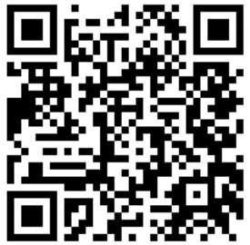

# Questionnaires et carnet de bord

Le **questionnaire avant l'utilisation** du Véhicule : [https://response.questback.com/ademe/txl80uuqyj](https://response.questback.com/ademe/txl80uuqyj)&#x20;

<figure><figcaption>
QR code Questionnaire avant utilisation
</figcaption></figure>

Le **carnet de bord** est à remplir après chaque trajet, au quotidien. C'est LE moyen principal pour bien comprendre comment vous utilisez le véhicule, les points positifs et les points à améliorer, votre expérience au quotidien. Il est essentiel ! [https://response.questback.com/ademe/wnjttg6gf4](https://response.questback.com/ademe/wnjttg6gf4)

<figure><figcaption>
QR code Carnet de bord
</figcaption></figure>

Le **questionnaire après l'utilisation du Véhicule, à remplir à la fin de la période d'essai** du véhicule : [https://response.questback.com/ademe/efjtsww1ve](https://response.questback.com/ademe/efjtsww1ve)

<figure><figcaption>
QR code questionnaire après utilisation
</figcaption></figure>

Si le testeur accède au prêt de plusieurs véhicules pendant l’expérimentation, il devra répondre autant de fois le questionnaire « après l’utilisation» qu’il aura testé des véhicules différents.
