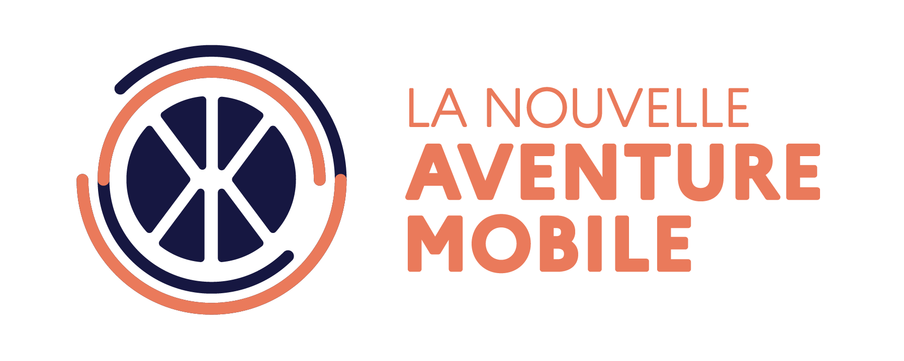

---
layout:
  title:
    visible: true
  description:
    visible: false
  tableOfContents:
    visible: true
  outline:
    visible: true
  pagination:
    visible: true
---

# La Nouvelle Aventure Mobile XD

<figure><figcaption></figcaption></figure>

**L'eXtrême Défi Mobilité** organise la production d’une offre industrielle de plusieurs véhicules intermédiaires. Les véhicules sont présentés sur le [Wiki](https://wikixd.fabmob.io/wiki/XD:Accueil) via le bandeau en haut / Découvrir / Les véhicules. Le défi est de réaliser des véhicules à haute efficacité énergétique, reconditionnables, éco-conçus, à durée de vie très longue, économiques et également désirables pour de nombreux cas d'usages et contextes territoriaux.

En parallèle, les expérimentations sont essentielles pour mieux comprendre les usages, les besoins, les comportements des utilisateurs pour ces nouveaux véhicules (lire cet [article](https://xd.ademe.fr/blog/devez-vous-etre-sur-que-les-clients-savent-ce-qu-ils-veulent) de blog). Cette exploration concrète se présente à travers **La Nouvelle Aventure Mobile** ! &#x20;

<figure><figcaption>
Logo : La Nouvelle Aventure Mobile XD
</figcaption></figure>

L’objectif de la Nouvelle Aventure Mobile est de mutualiser à la fois les enseignements, des ressources, mais aussi le travail avec un nombre restreint de collectivités à plusieurs niveaux administratifs (commune, communauté de communes, département, région, état). Il s'agit également de concentrer les expérimentations dans un nombre limité de territoire pour mieux gérer la logistique des véhicules, habituer tous les usagers de la route à ces véhicules. Ces territoires sont organisés pour accueillir des expérimentations en ayant rassemblés les différents acteurs (association, commune, sécurité routière, préfecture)

En conséquence, les constructeurs de véhicules intermédiaires sont invités à expérimenter en priorité dans ce réseau de territoires volontaires. Dans ces territoires, il sera possible d'expérimenter des véhicules intermédiaires fonctionnels et homologués et pour certains non homologués.

Il est (fortement) conseillé aux personnes impliquées dans les expérimentations de découvrir l’XD à travers :

* Les [articles de blog](https://xd.ademe.fr/blog),
* Les [réunions du jeudi matin](https://wikixd.fabmob.io/wiki/D%C3%A9couvrir\_et\_s'impliquer\_dans\_les\_%C3%A9v%C3%A8nements\_et\_conf%C3%A9rences\_de\_l'XD),
* Le [wiki](https://wikixd.fabmob.io/wiki/XD:Accueil) en naviguant avec le bandeau en haut
* Le [Forum](https://forum.fabmob.io/c/extreme-defi/25) pour rejoindre les discussions
* Les différents [Groupes de Travail (GT)](https://wikixd.fabmob.io/wiki/GT\_collaboratifs\_de\_l'XD)
* et les nombreux évènements en présentiel (voir [l'Agenda](https://wikixd.fabmob.io/wiki/D%C3%A9couvrir\_et\_s'impliquer\_dans\_les\_%C3%A9v%C3%A8nements\_et\_conf%C3%A9rences\_de\_l'XD))


TO BE REMOVED -> GUIDE INVD [https://docs.google.com/document/d/1Mri1fdlvciCCANf4vVR8ZzO\_Yhvy1CGti3qRCL4nltM/edit#heading=h.23ckvvd](https://docs.google.com/document/d/1Mri1fdlvciCCANf4vVR8ZzO\_Yhvy1CGti3qRCL4nltM/edit#heading=h.23ckvvd)

