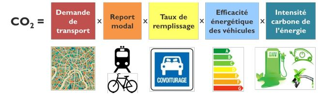
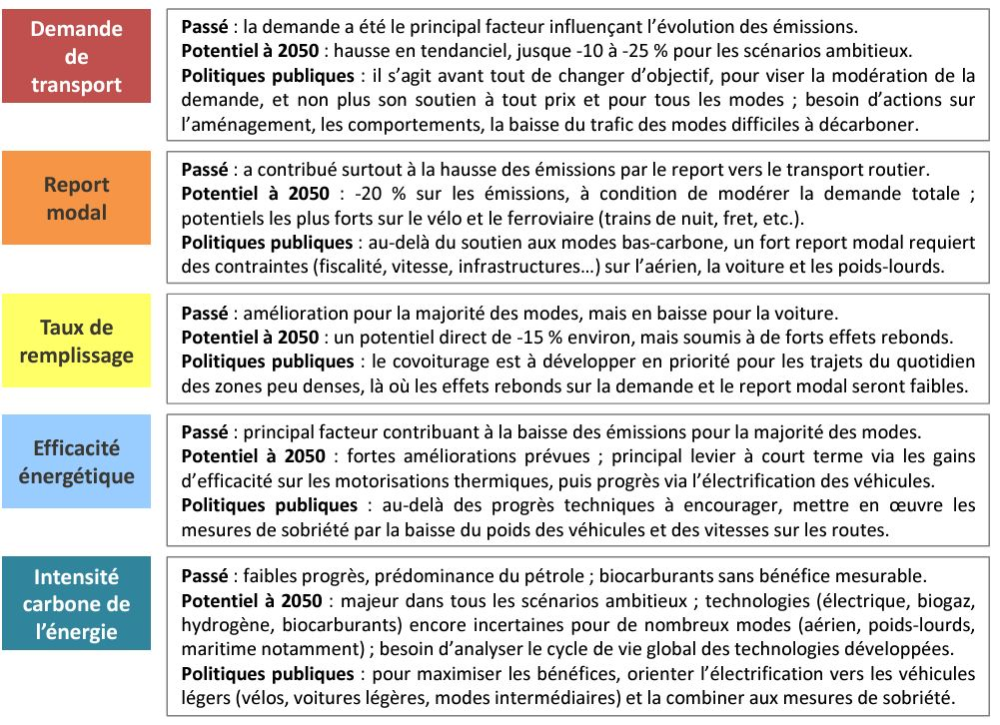

---
layout:
  title:
    visible: true
  description:
    visible: false
  tableOfContents:
    visible: true
  outline:
    visible: true
  pagination:
    visible: true
---

# Enjeux de la transition des mobilités pour un territoire

Les consommations énergétiques des transports de biens et de marchandises augmentent et, avec elles, leurs émissions de gaz à effet de serre. Le secteur des transports consomme majoritairement des énergies fossiles, ce qui maintient la France dans une forte dépendance vis-à-vis de ses fournisseurs étrangers, dans un contexte de tensions géopolitiques et économiques. De plus, les transports majoritairement carbonés ont un impact sur la santé humaine et sur l’environnement. Ils contribuent au changement climatique. Dans les centres villes, les transports collectifs, la marche ou encore le vélo constituent des alternatives crédibles et souhaitables pour de nombreux territoires. Par contre, des les territoires ruraux, avec une faible densité de population, l'automobile reste la principale solution pour se déplacer au quotidien.&#x20;

Il est urgent d’agir pour proposer des alternatives, pour réduire la dépendance à l'automobile et aux carburants fossiles.

### Départ&#x20;

***

Le secteur des transports est le premier secteur d'émissions de GES domestique. Le premier levier de réduction des émissions de GES du transport réside dans la modération de nos déplacements, dans la mesure du possible. Pour réduire l'impact environnemental de la mobilité, et notamment ses émissions de GES, le report modal depuis des modes de transport individuels et émissifs vers des transports collectifs ou de la mobilité douce est une évolution essentielle, aux multiples co-bénéfices socio-économiques et sanitaires. La transition écologique du secteur des transports vise également à réduire la consommation de carburants fossiles, source d'émissions de GES, de pollution atmosphérique et de dépendance économique.

Le Secrétariat Général à la Planification Ecologique [**publie un tableau de bord**](https://e.infogram.com/95444dec-4126-496a-85ce-6a017217c0a4?src=embed), avec un volet sur les transports. La stratégie nationale bas carbone fixe 5 leviers pour réduire les émissions.

<figure><figcaption>
Résumé de thèse Aurélien Bigo, Novembre 2020
</figcaption></figure>

<figure><figcaption>
Résumé de thèse Aurélien Bigo, Novembre 2020
</figcaption></figure>

Les territoires sont tenus de mettre en place une politique de décarbonation des mobilités, afin d’œuvrer à l’objectif de la France d’atteindre la neutralité carbone en 2050 ([glossaire](../glossaire/)). Plus largement, un territoire a tout intérêt à diversifier les solutions de mobilités disponibles pour réduire sa dépendance, augmenter sa résilience et garantir au plus grand nombre des moyens de réaliser leurs activités quotidiennes.&#x20;

### Données

<figure><figcaption>
Raport de synthése de GIEC
</figcaption></figure>

***

**Le premier enjeu de la transition des mobilités est d'impliquer les usagers** (citoyens, entreprises de transport de marchandises…) pour les amener à utiliser des véhicules plus sobres et bien moins polluants.&#x20;

Les véhicules intermédiaires sont de ceux-là. Ils seront mis en vente d’ici 2030 et devront durer plusieurs décennies. D’autant plus que l’objectif de neutralité carbone en 2050 est primordial pour limiter le réchauffement climatique en dessous de +2°C, sachant qu’un maintien sous le seuil des +1,5°C, qui « garantit un avenir viable » selon le rapport 2023 du GIEC, n’est quasiment plus plausible, à moins d’un sursaut conséquent avant 2025.&#x20;

Le Ministère de la Transition écologique et solidaire a élaboré en 2018 une stratégie nationale bas carbone (SNBC), révisée en 2020 (SNBC-2) puis fin 2023 (SNBC-3).&#x20;

La SNBC-3 doit s’aligner sur les engagements de l’Union européenne qui, en décembre 2020, a porté son objectif de réduction d’émissions de gaz à effet de serre à 55% entre 1990 et 2030, au lieu de 40% antérieurement.&#x20;

L’ambition est d’atteindre la neutralité carbone en 2050. Les territoires sont aux premières lignes du changement et les véhicules intermédiaires constituent une réponse, parmi d’autres, à l’exigence de transition des mobilités, notamment en zone rurale.

**Deuxième enjeu de la transition des mobilités : l’inclusion.** Il s’agit d’inclure les laissés pour compte de la mobilité, les « assignés à résidence », expression récemment utilisée pour désigner un public très éloigné de l’emploi, des services de santé ou des besoins du quotidien pour des raisons sociales, physiques ou cognitives.&#x20;

Les véhicules intermédiaires à mobilité passive ou active et roulant à moins de 45 km/h sont une solution de mobilité accessible à tous les publics et peuvent contribuer à limiter la fracture sociale.&#x20;

### Débrouille

***

* [ ] Connaître les offres de transports et les données du territoire : volume de trafic sur les principaux axes du territoires pour tous les modes de transports, identification des pôles générateurs de trafic (zone d'activité, université, hôpital, etc), empreinte carbone des transports, inclusivité (personnes seules éloignées, sans permis de conduire, à mobilité réduite…).
* [ ] Identifier les acteurs locaux : associations de réinsertion ou d’aide, de mobilité, de soutien aux personnes en situation de handicap.
* [ ] Connaître les besoins d’emploi des entreprises et artisans du bassin économique local.
* [ ] Organiser une [Fresque de la Mobilité](https://fresquedelamobilite.org/) est également une bonne stratégie.
